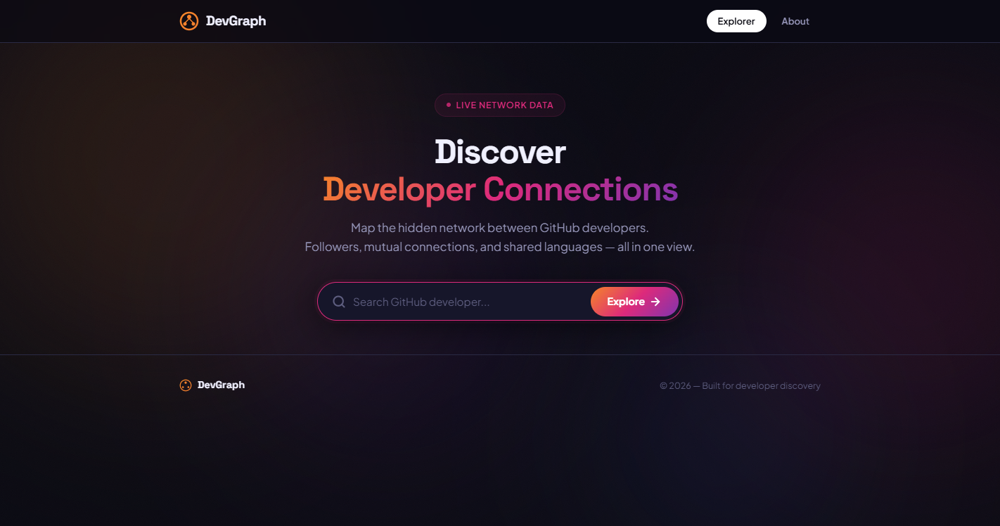
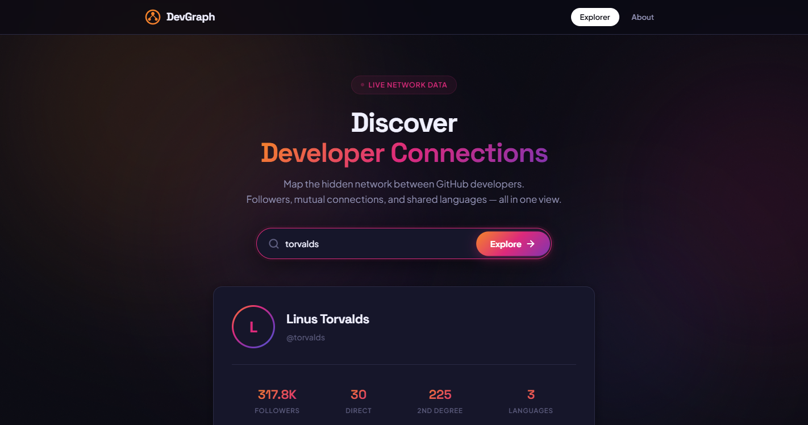
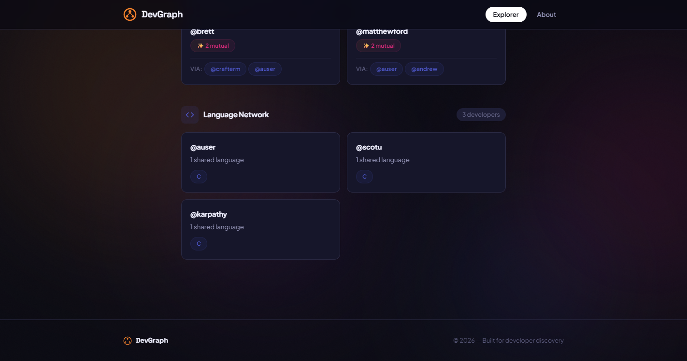

# DevGraph — GitHub Developer Network Explorer

> **Wexa AI Take-Home Assignment Submission**
> A full-stack web application that maps the hidden social graph between GitHub developers using a graph database.

**Live Demo:** [https://devgraph.onrender.com](https://devgraph.onrender.com)
*(Deployed on Render.com free tier)*

**Demo Video:** [`docs/demo-recording`](.) — see [Deliverables note](#deliverables-note) below.

---

## Table of Contents

1. [Use Case](#use-case)
2. [Why a Graph Database?](#why-a-graph-database)
3. [Data Model](#data-model)
4. [Setup & Run Instructions](#setup--run-instructions)
5. [Main Queries Explained](#main-queries-explained)
6. [API Endpoints](#api-endpoints)
7. [Architecture](#architecture)
8. [UI Screenshots](#ui-screenshots)

---

## Use Case

**Problem:** GitHub shows developer profiles and follower lists, but provides no way to explore the *network topology* between developers. You can see who follows you, but you can't discover:
- Who follows the people you follow (second-degree connections)
- Which developers share your programming languages
- Who might be a valuable connection based on mutual followers

**Solution:** DevGraph transforms GitHub's flat follower data into an interactive network graph. Search any GitHub username and instantly see:
- Their profile and stats
- Direct followers (1-hop connections)
- Followers of followers (2-hop connections) — potential new connections
- Language-based network — developers who code in the same languages

**Real-World Value:**
- **Open-source maintainers** can find contributors with shared language expertise
- **Developers** can discover potential collaborators in their tech stack
- **Recruiters** can map talent networks around key developers
- **Community builders** can identify bridge developers connecting different groups

---

## Why a Graph Database?

### The Problem with Relational Databases

A traditional SQL approach would model this as:

```
developers table          follows table           languages table
+----+----------+        +----------+---------+  +----+-----------+
| id | username |        | from_id  | to_id   |  | id | name      |
+----+----------+        +----------+---------+  +----+-----------+
| 1  | torvalds |        | 2        | 1       |  | 1  | C         |
| 2  | gaearon  |        | 3        | 1       |  | 2  | JavaScript|
+----+----------+        +----------+---------+  +----+-----------+
```

To find "followers of followers" (2-hop), you'd need:

```sql
SELECT DISTINCT f2.to_id
FROM follows f1
JOIN follows f2 ON f1.to_id = f2.from_id
WHERE f1.from_id = ?
AND f2.to_id != ?
```

This gets exponentially expensive as you add hops. A 3-hop query would need 3 self-joins.

### The Graph Database Advantage

With Neo4j, the same query is:

```cypher
MATCH (me:Developer {username: $username})
      <-[:FOLLOWS]-(follower:Developer)
      <-[:FOLLOWS]-(friend:Developer)
WHERE me.username <> friend.username
RETURN friend.username, COUNT(*) AS mutual
ORDER BY mutual DESC
```

**Why graphs win here:**

| Aspect | SQL (Relational) | Neo4j (Graph) |
|--------|-------------------|---------------|
| 2-hop traversal | 2 JOINs, expensive | Native traversal, O(k) |
| 3-hop traversal | 3 JOINs, very expensive | Still O(k), practical |
| Relationship queries | Complex subqueries | Simple pattern matching |
| Schema changes | ALTER TABLE, migrations | Add relationship type |
| Performance at scale | Degrades with hops | Constant per hop |

**In short:** Social networks *are* graphs. Modeling them as graphs makes traversal queries natural, fast, and scalable.

---

## Data Model

### Node Types

```
Developer (label)
├─ Properties: username (UNIQUE), name, followers, public_repos, profile_url
├─ Relationships:
│  ├─ [:FOLLOWS] → Developer
│  ├─ [:PROGRAMS_IN] → Language
│  └─ [:OWNS] → Repository

Language (label)
├─ Properties: name (UNIQUE)
└─ Relationships:
   └─ [:USED_BY] → Developer (reverse of PROGRAMS_IN)

Repository (label)
├─ Properties: name, url, stars
└─ Relationships:
   └─ [:OWNED_BY] → Developer (reverse of OWNS)
```

### Graph Visualization

```
                    ┌─────────────┐
         ┌─────────│   Language   │◄────────┐
         │         │  (name: "C") │         │
         │         └─────────────┘         │
         │ PROGRAMS_IN               PROGRAMS_IN
         ▼                                 ▼
┌─────────────┐   FOLLOWS   ┌─────────────┐
│  Developer  │◄────────────│  Developer  │
│ "gaearon"   │             │ "torvalds"  │
└─────────────┘             └──────┬──────┘
                                   │ OWNS
                                   ▼
                            ┌─────────────┐
                            │ Repository  │
                            │ "linux"     │
                            └─────────────┘
```

### Indexes & Constraints

```cypher
CREATE CONSTRAINT developer_unique IF NOT EXISTS
  FOR (d:Developer) REQUIRE d.username IS UNIQUE;

CREATE INDEX developer_username IF NOT EXISTS
  FOR (d:Developer) ON (d.username);

CREATE INDEX language_name IF NOT EXISTS
  FOR (l:Language) ON (l.name);

CREATE INDEX repo_name IF NOT EXISTS
  FOR (r:Repository) ON (r.name);
```

---

## Setup & Run Instructions

### Prerequisites

- Python 3.11+
- A [CognoDB account](https://cognodb.cloud) (free tier — Neo4j managed cloud)
- A [GitHub Personal Access Token](https://github.com/settings/tokens)

### Creating a CognoDB Instance

1. Sign up at [console.cognodb.com/signup](https://console.cognodb.com/signup)
2. Create a new database instance (free c0 tier)
3. Note down:
   - **URI:** `bolt+s://<instance-id>.databases.cognodb.cloud`
   - **Username:** `cognodb`
   - **Password:** (your chosen password)

### Local Setup

```bash
# Clone the repository
git clone https://github.com/ACprime4385/graph-app.git
cd graph-app

# Create virtual environment
python -m venv venv
venv\Scripts\activate       # Windows
# source venv/bin/activate  # macOS/Linux

# Install dependencies
pip install -r requirements.txt

# Create environment file
copy .env.example .env      # Windows
# cp .env.example .env      # macOS/Linux

# Edit .env with your credentials:
# NEO4J_URI=bolt+s://your-instance.databases.cognodb.cloud
# NEO4J_USER=cognodb
# NEO4J_PASSWORD=your_password
# GITHUB_TOKEN=ghp_your_token

# Run the application
python src/app.py

# Open http://localhost:8080
```

### Optional: Seed Initial Data

```bash
python scripts/seed_data.py torvalds gaearon tj
```

This pre-loads developer data so searches are instant.

### Deployment to Render

```bash
# Push to GitHub
git remote add origin https://github.com/ACprime4385/graph-app.git
git push -u origin main

# On render.com:
# 1. New Web Service → Connect GitHub repo
# 2. Build: pip install -r requirements.txt
# 3. Start: gunicorn src.app:app
# 4. Add env vars: NEO4J_URI, NEO4J_USER, NEO4J_PASSWORD, GITHUB_TOKEN
# 5. Deploy
```

---

## Main Queries Explained

### Query 1: Get Developer Profile

```cypher
MATCH (d:Developer {username: $username})
RETURN d.username AS username,
       d.name AS name,
       d.followers AS followers,
       d.public_repos AS public_repos,
       d.profile_url AS profile_url
```

**What it does:** Direct lookup by username. Uses the unique index for O(1) performance.

### Query 2: Direct Followers (1-hop)

```cypher
MATCH (follower:Developer)-[:FOLLOWS]->(d:Developer {username: $username})
RETURN follower.username AS username,
       follower.followers AS followers,
       follower.profile_url AS profile_url
ORDER BY follower.followers DESC
LIMIT $limit
```

**What it does:** Traverses all incoming `FOLLOWS` edges to find who follows this developer. Results are ranked by follower count.

### Query 3: Second-Degree Connections (2-hop) ⭐

```cypher
MATCH (me:Developer {username: $username})
      <-[:FOLLOWS]-(follower:Developer)
      <-[:FOLLOWS]-(friend:Developer)
WHERE me.username <> friend.username
  AND NOT (friend)-[:FOLLOWS]->(me)
RETURN DISTINCT friend.username AS username,
       COUNT(*) AS mutual_connections
ORDER BY mutual_connections DESC
LIMIT $limit
```

**What it does:** Finds people who follow your followers but don't follow you directly. The `COUNT(*)` ranks them by how many mutual connections they have. This is the "people you may know" algorithm.

**Key optimizations:**
- `WHERE me.username <> friend.username` — excludes self-loops
- `NOT (friend)-[:FOLLOWS]->(me)` — excludes existing followers
- `DISTINCT` — prevents duplicate counting

### Query 4: Language Network (2-hop) ⭐

```cypher
MATCH (me:Developer {username: $username})
      -[:PROGRAMS_IN]->(lang:Language)
      <-[:PROGRAMS_IN]-(other:Developer)
WHERE me.username <> other.username
RETURN other.username AS username,
       COUNT(DISTINCT lang) AS shared_languages,
       COLLECT(DISTINCT lang.name) AS languages
ORDER BY shared_languages DESC
LIMIT $limit
```

**What it does:** Finds developers who share at least one programming language. Results are ranked by the number of shared languages. Useful for finding collaborators in your tech stack.

### Query 5: Network Statistics

```cypher
// Direct followers count
MATCH (f:Developer)-[:FOLLOWS]->(d:Developer {username: $username})
RETURN COUNT(f) AS direct_followers

// Second-degree count
MATCH (me:Developer {username: $username})
      <-[:FOLLOWS]-(:Developer)
      <-[:FOLLOWS]-(friend:Developer)
WHERE me.username <> friend.username
RETURN COUNT(DISTINCT friend) AS second_degree

// Languages count
MATCH (d:Developer {username: $username})
      -[:PROGRAMS_IN]->(l:Language)
RETURN COUNT(l) AS languages
```

---

## API Endpoints

| Endpoint | Method | Description | Parameters |
|----------|--------|-------------|------------|
| `/api/health` | GET | Database health check | — |
| `/api/developer/<username>` | GET | Developer profile | — |
| `/api/followers/<username>` | GET | Direct followers (1-hop) | `?limit=20` |
| `/api/second-degree/<username>` | GET | Followers of followers (2-hop) | `?limit=10` |
| `/api/language-network/<username>` | GET | Shared language network | `?limit=15` |
| `/api/network-stats/<username>` | GET | Aggregated stats | — |

### Error Responses

All errors follow a consistent format:

```json
{
  "error": "Human-readable message",
  "status_code": 400,
  "timestamp": "2026-08-24T15:30:00Z"
}
```

| Status | Meaning |
|--------|---------|
| 200 | Success |
| 400 | Invalid username format |
| 404 | Developer not found on GitHub |
| 500 | Internal server error |
| 503 | Database unavailable |

---

## Architecture

```
┌─────────────────────────────────────────────────┐
│                  USER BROWSER                     │
│  HTML5 + CSS3 (Instagram-inspired theme)          │
│  Vanilla JavaScript (ES6+ async/await)            │
└────────────────────┬────────────────────────────┘
                     │ HTTP
┌────────────────────▼────────────────────────────┐
│              FLASK BACKEND (Python 3.11)          │
│  ┌──────────┐  ┌──────────┐  ┌──────────────┐  │
│  │ Routes   │  │ Validation│  │ Error Handler│  │
│  │ (app.py) │  │ (regex)  │  │ (JSON)       │  │
│  └────┬─────┘  └──────────┘  └──────────────┘  │
│       │                                          │
│  ┌────▼─────────────────────────────────────┐   │
│  │        database.py (Neo4j Driver)        │   │
│  │  query() — parameterized Cypher reads    │   │
│  │  execute() — parameterized Cypher writes │   │
│  └────┬───────────────────────┬─────────────┘   │
└───────┼───────────────────────┼─────────────────┘
        │ Bolt Protocol          │ HTTPS
┌───────▼──────────┐  ┌─────────▼─────────────────┐
│  CognoDB Cloud   │  │   GitHub REST API v3       │
│  (Neo4j 5.x)    │  │   /users/:username         │
│                  │  │   /users/:username/followers│
│  Developer nodes │  │   /users/:username/repos    │
│  Language nodes  │  │                             │
│  Repository nodes│  │   Rate limit: 60/hr (free)  │
└──────────────────┘  └────────────────────────────┘
```

### Project Structure

```
graph-app/
├── src/
│   ├── __init__.py
│   ├── app.py              # Flask routes & middleware
│   ├── database.py          # Neo4j connection & queries
│   └── github_loader.py     # GitHub API → Neo4j pipeline
├── templates/
│   └── index.html           # Main HTML template
├── static/
│   ├── style.css            # Instagram-inspired theme
│   └── app.js               # Frontend logic
├── scripts/
│   ├── seed_data.py         # CLI data loader (seed specific users)
│   └── build_network.py     # Builds a 2-level demo network for 2nd-degree queries
├── docs/
│   └── screenshots/         # UI screenshots used in this README
├── tests/
│   └── test_api.py          # API validation tests
├── .env.example             # Credential template
├── .gitignore
├── Procfile                 # Render deployment
├── runtime.txt              # Python version
├── requirements.txt         # Dependencies
└── README.md                # This file
```

---

## UI Screenshots

### Search Interface
The app opens with a clean, Instagram-inspired search interface with animated gradient background.



### Profile & Network Results
After searching, a profile card displays with the developer's stats: followers, direct connections, 2nd-degree reach, and language count.



### Network Grids
Three card grids display:
1. **Direct Followers** — ranked by follower count
2. **Second-Degree Connections** — ranked by mutual connections (with the mutual followers who link them)
3. **Language Network** — ranked by shared languages



### Loading State
A triple-ring animation displays while data is being fetched.

### Error State
A toast notification appears for invalid usernames, API errors, or database issues.

### Empty State
When no data is available (new developer, no connections yet), a friendly empty state message is shown.

---

## Tech Stack

| Layer | Technology | Why |
|-------|-----------|-----|
| Backend | Python 3.11 + Flask | Lightweight, fast development |
| Database | Neo4j (CognoDB Cloud) | Native graph traversal |
| Frontend | Vanilla JS + HTML/CSS | Zero dependencies, fast load |
| API | GitHub REST API v3 | Real developer data |
| Hosting | Render.com | Free tier, auto-deploy |
| Fonts | Plus Jakarta Sans + Space Grotesk | Premium typography |

---

## Deliverables Note

- **Hosted demo:** https://devgraph.onrender.com (Render.com free tier)
- **Screen recording:** a short walkthrough video of searching a developer and exploring their network should be added at `docs/demo-recording.mp4` before submission (record with any screen recorder, e.g. OBS or the Windows/Game Bar recorder `Win+G`).

## License

MIT License — Free to use and modify.

---

*Built as a Wexa AI take-home assignment submission.*
